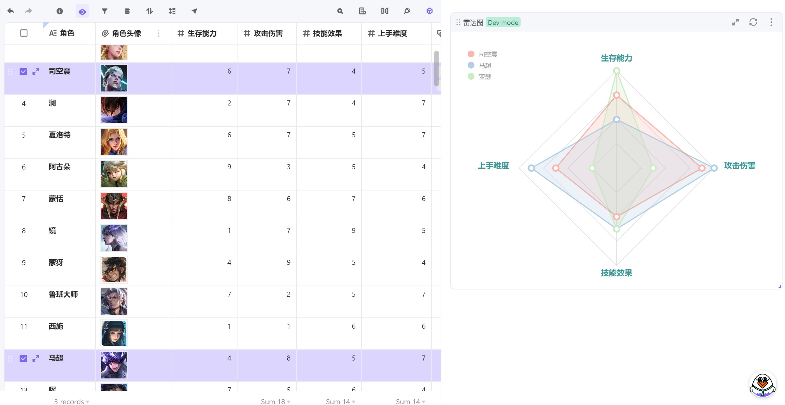

# 维格小程序 - 雷达图

一款支持多条记录多项指标对比的雷达图（维格表小程序）

## 🎨 介绍

 

**已经实现的功能特性：**

- [x] 最多支持选择 4 个数字类型字段作为维度统计
- [x] 鼠标选中若干行，实时渲染结果

 

**正在规划/迭代的功能：**
- [ ] 多种颜色主题切换
- [ ] 支持图形持久化
- [ ] 支持导出图片
- [ ] 支持自定义维度的个数
- [ ] 更丰富的配置项

## 🎯 更新日志

2022年1月30日（Tag: v0.0.6）

- 支持至多9个维度的自定义设置

2022年01月11日

- 初始化工程（Tag: MVP）
